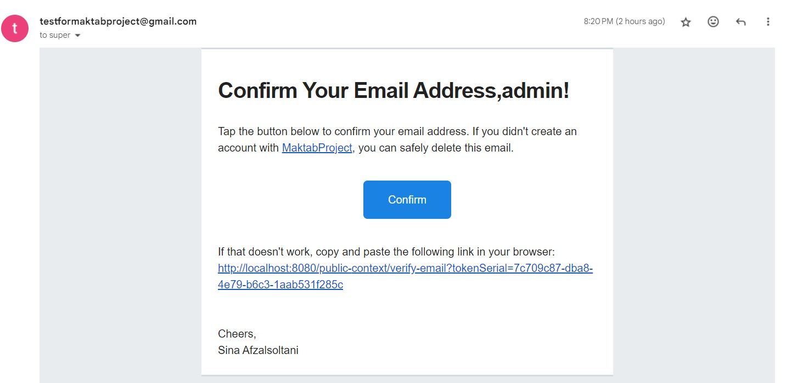

# Java Backend Project

This is the backend of a web-app that connects you with local professionals for a wide range of services, including handyman work, plumbing, and electrical services, etc.

This is the final project of an extensive Java backend development bootcamp @ www.maktabsharif.ir

## Author

- [Sina Afzalsoltani](https://github.com/SinaAfzal)

## License

All rights reserved

## Key Features
- Using Spring boot, Spring Security, Spring MVC,Spring Data-JPA, JSP, JavaCore, etc:
- Admins can manage task categories/sub-categories
- Advanced Task Search on admin panel using criteria API
- Advanced User Search on admin panel using criteria API
- Customers can create/manage a task request
- Tradesmen can send proposals for task requests
- Customers can choose from the received proposals
- Customers can pay the tradesman, comment and rate the task
- payment page is protected by Google ReCAPTCHA v2
- Email addresses are confirmed by a one-time-use, automatically-generated and self-destructing link sent to the user by email.
- And many more cool features!

## Screenshots
### Email Verification

### Payment Page

### Example Requests
#### Postman

